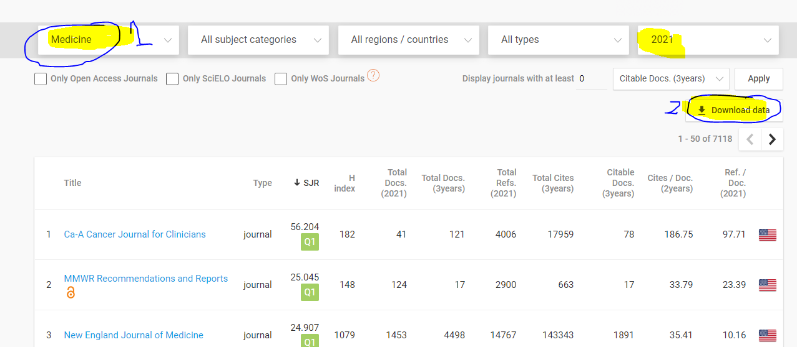

#  Exercici explotació fitxers CSV (2022 - 2023)
## <center>Pablo Garcia, Miquel Angel Amoros.</center>

[Font de dades: Web Scimago ](https://www.scimagojr.com/journalrank.php?area=2700 "Web font de dades ")

> The SCImago Journal & Country Rank is a publicly available portal that includes the journals and country scientific indicators developed from the information contained in the **Scopus® database.** 
> **These indicators can be used to assess and analyze scientific domains.** Journals can be compared or analysed separately. Country rankings may also be compared or analysed separately.

En altres paraules, és una organització que analitza mitjançant diverses mètriques la qualitat de les publicacions cientìfiques: l'H-Index, el total absolut d'articles citats, documents publicats durant 1 i 3 anys...

###  **Practica explotar un fitxer** i resoldre diferents consultes.

L'any passat ens vam descarregar el fitxer de dades, versió 2021-2022 : [aqui](./scimago-medicine.csv "aqui")

Igualment, recomanem tornar a descarregar el CSV original.
Per a extreure la versió més recent del fitxer, consulteu la web:
[Font de dades: Web Scimago ](https://www.scimagojr.com/journalrank.php?area=2700 "Web font de dades ")

1. Seleccionem els articles de "Medicine" del 2021.
2. La resta de camps deixem els que indica per defecte.
3. Finalment, pitgem a "Download Data".




#### Entries from SciMago

Per llegir un fitxer a Python, utilitzarem una funció que li passarem la ruta i retornarà una llista amb totes les línies del fitxer. 

```python
# How to define a function in python with the word key
# the type date after the : is only documentation for Python
def read_csv_file(csv_file_path: str) -> list:
    
    with open(csv_file_path, newline='') as csvfile:
        csv_reader=csv.DictReader(csvfile, delimiter=";")
        result = [row_dict for row_dict in csv_reader]
        
    return result
```

D'aquesta manera anomenem la funció que ens tornarà el contingut.


```python
# Import notebook
# How to import a notebook a file

import csv
csv_file_path = "scimago-medicine.csv"
entries = read_csv_file(csv_file_path)
entries[0]       
```

>    {'Rank': '1',
>    'Sourceid': '28773',
>    'Title': 'Ca-A Cancer Journal for Clinicians',
>    'Type': 'journal',
>    'Issn': '15424863, 00079235',
>    'SJR': '62,937',
>    'SJR Best Quartile': 'Q1',
>    ...
>    'Categories': 'Hematology (Q1); Oncology (Q1)'}


## Exercicis.

**Es publicaran les solucions obtingudes al final de cada sessió. Tant les del Miquel com les del Pablo i les vostres solucions proposades.**

També s'enviarà codi intermig per a donar-vos pistes i solucions durant la sessió a:
[https://etherpad.wikimedia.org/p/m14-uf1-uf2](Wiki Etherpad M14)


* [Q1 - How many entries are in scimago-medicine.csv?](#ex1)
* [Q2 - Show the first 25 entries.](#ex2)
* [Q3 - Compta el número d'entrades publicades a Espanya en una llista (Country = Spain)](#ex3)
* [Q4 - Mostra les revistes (Type = journal) publicades a UK (Country = United Kingdom) i que tinguin un H index superior a 200.](#ex4)
* [Q5 - What types of scientific publications are in the file ?](#ex5)
* [Q6 - List all the avaliable categories. Each entry can have more than one category.](#ex6)
* [Q7 - Show all data from the category with most entries."](#ex7)
* [Q8 - Show all data from entries of categories: "Sports Medicine" or "Sports science"](#ex8)
* [Q9 - All regions covered by all entries.](#ex9)
* [Q10 - Mean of H-index by region.](#ex10)
* [Q11 - What is the oldest publisher that is still active?](#ex11)


### Read Entries from SciMago CSV file.

```python
# How to define a function in python with the word key
# the type date after the : is only documentation for Python
def read_csv_file(csv_file_path: str) -> list:
    
    with open(csv_file_path, newline='') as csvfile:
        csv_reader=csv.DictReader(csvfile, delimiter=";")
        result = [row_dict for row_dict in csv_reader]
        
    return result
```


```python
# Import notebook
# How to import a notebook a file

import csv
csv_file_path = "scimago-medicine.csv"
entries = read_csv_file(csv_file_path)
# entries = entries[0:10] opció per a quedar-se sol amb els 10 primers , per poder fer proves.
entries[0]
```

```python
>    {'Rank': '1',
>     'Sourceid': '28773',
>     'Title': 'Ca-A Cancer Journal for Clinicians',
>     'Type': 'journal',
>     'Issn': '15424863, 00079235',
>     'SJR': '62,937',
>     'SJR Best Quartile': 'Q1',
>     'H index': '168',
>     'Total Docs. (2020)': '47',
>     'Total Docs. (3years)': '119',
>     'Total Refs.': '3452',
>     'Total Cites (3years)': '15499',
>     'Citable Docs. (3years)': '80',
>     'Cites / Doc. (2years)': '126,34',
>     'Ref. / Doc.': '73,45',
>     'Country': 'United States',
>     'Region': 'Northern America',
>     'Publisher': 'Wiley-Blackwell',
>     'Coverage': '1950-2020',
>     'Categories': 'Hematology (Q1); Oncology (Q1)'}
>     
```

#### Enunciat i solució dels exercicis (pròximament). 

<a name="ex1"></a>
**Question 1** How many entries are in scimago-medicine.csv?

```python
num = len(entries)
print(f"There are {num} entries.")
```

<a name="ex2"></a>

**Question 2** Show the first 25 entries.

```python
print(entries[0:25])
```

<a name="ex3"></a>

**Question 3**
Compta el número d'entrades publicades a Espanya en una llista (Country = Spain)

```python
#Solució 31
numEntriesSpain: int = 0
for entry in entries:
    if(entry['Country'] == 'Spain'):
        numEntriesSpain+=1

print(numEntriesSpain)

#Solució 32, funcional.
def filterEntrySpain (entry:dict) -> bool:      
        return entry['Country'] == 'Spain'

entriesSpain= list(filter(filterEntrySpain,entries))
print(len(entriesSpain))
```

<a name="ex4"></a>

**Question 4** Mostra les revistes (Type = journal) publicades a UK (Country = United Kingdom) i que tinguin un H index superior a 200.

```python
# Solucio FUNCIONAL.
def filterUKJournalHIndex300 (entry:dict) -> bool:      
        return entry['Country'] == 'United Kingdom' and entry['Type'] == 'journal' and int(entry['H index']) > 200                          

entriesUKJournalHIndex300 = list(filter(filterUKJournalHIndex300,entries))                          
print(len(entriesUKJournalHIndex300))
```

<a name="ex5"></a>

**Question 5** What types of scientific publications are in the file ? Show the name of all types.

**Expected Result:**
```python
['journal', 'book series', 'conference and proceedings', 'trade journal']
```

<a name="ex6"></a>

**Question 6**  List all the avaliable categories. Each entry can have more than one category.

**Hint: Split function.**
```python
# One entry can belong to one or more categories. These are separated by semicolon (;) 
# You should remove the quarter characters (Q1),(Q2)... between categories.

import re
text = "python is, an easy;language; to, learn."
print(re.split('; |, ', text))
['python is', 'an easy;language', 'to', 'learn.']
```

<a name="ex7"></a>

**Question 7** Show all data from the category with most entries.

**Hint: Create a dict. The keys are the entry name, the values are the number of entres **

**Expected Result**
```python
1 - Medicine (miscellaneous) : 2447 2 - Public Health, Environmental and Occupational Health : 560 3 - Psychiatry and Mental Health : 537 ...
```

<a name="ex8"></a>

**Question 8** Show all data from entries of categories: "Sports Medicine" or "Sports science".

**Hint. Use operator in "Sports".**


<a name="ex9"></a>

**Question 9** All regions covered by all entries.

**Hint. Use operator in "Sports".


<a name="ex10"></a>

**Question 10** Mean of H-index by region.

**Observation. Mean = Average. Promedio in Spanish. Do not get confused with Median, is another measure.**

<a name="ex11"></a>

**Question 11** What is the oldest publisher that is still active?

**Observation. Has some publication in 2021.**


