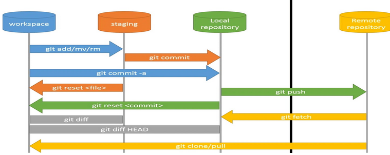

# Cheatsheet Visual comandes bàsiques de treball





### Com fer una copia de seguretat dels repositoris.


```bash
rsync -va (carpetaOrigen) (carpetaDestino)
```

- ANAR AMB COMPTE amb les [TRAILING SLASHES](https://en.ryte.com/wiki/Trailing_Slashes "Trailing Slashes")


