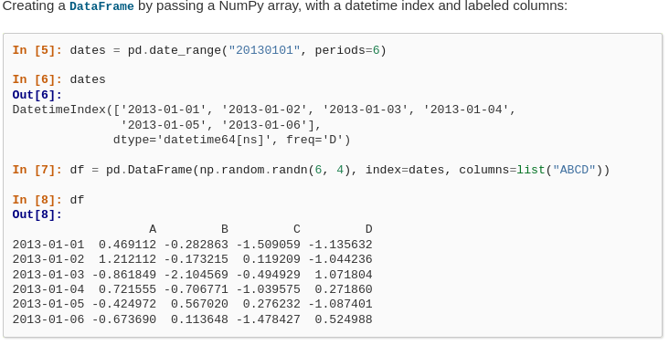
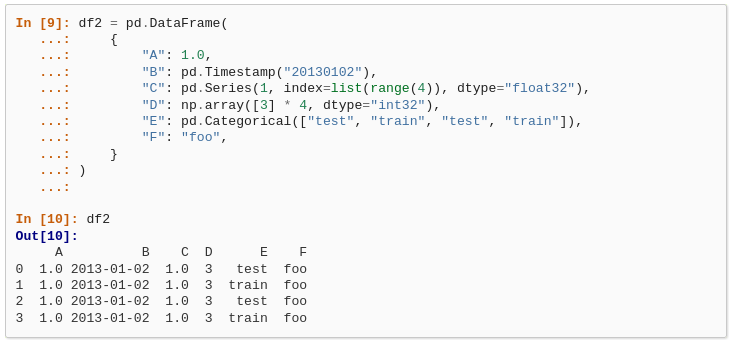

# PANDAS

- [PANDAS](#pandas)
  - [Instal·lacio Pandas a conda:](#installacio-pandas-a-conda)
      - [Instruccions](#instruccions)
  - [Series](#series)
  - [DTYPE. Tipus de dades que s'utilitzen a Pandas](#dtype-tipus-de-dades-que-sutilitzen-a-pandas)
  - [DataFrame](#dataframe)
    - [Altres tipus de dades.](#altres-tipus-de-dades)
      - [Categorical](#categorical)
      - [Timestamp](#timestamp)
    - [Cheatsheet instruccions bàsiques.](#cheatsheet-instruccions-bàsiques)
    - [Funcions bàsiques de Pandas.](#funcions-bàsiques-de-pandas)
        - [Mostrar les primeres línies](#mostrar-les-primeres-línies)
          - [Linea aleatòria](#linea-aleatòria)
        - [Trasposar la matriu](#trasposar-la-matriu)
        - [Ordenació dataframe per un índex](#ordenació-dataframe-per-un-índex)
        - [Sistema coordenades](#sistema-coordenades)
        - [Búsqueda de varis valors en diferentes columnes](#búsqueda-de-varis-valors-en-diferentes-columnes)
        - [Masks](#masks)


## Instal·lacio Pandas a conda: 

#### [Instruccions](https://anaconda.org/anaconda/pandas)

```sh
conda install -c anaconda pandas
```

Per fer una introducció a Pandas, durant varies sessions, seguirem el tutorial oficial de [pandas 10 minutes](https://pandas.pydata.org/pandas-docs/stable/user_guide/10min.html "pandas 10 minutes")


Les primeres llibreries a importar son dues:

 · **np** --> numerical panda, és una llibreria per a realitzar càlcul numèric
 
 · **pd** --> llibreria panda, és la llibreria per a gestionar i analitzar dades tabulars(dades amb format de taula)

```python
import numpy as np 
import pandas as pd
```

 Panda utilitza dos tipus dades bàsics:
 1. **Series** , estructura 1D que s'assembla a una llista.
 2. **DataFrame**, estructura 2D que presenta les dades com una taula, o en definitiva un conjunt de Series.
 
 
 **Exemple: Crearem una taula d'alumnes que volen estudiar amb format dual**
 
 **Series**
 ```python
names_list = ["John","Mary","Lucy","Peter"]
grades_ser=[7,9,8,4]
wants_dual_ser = [False, True, False, True]
```
**DataFrame**

| Name  | Grade  | Wants Dual   |
| -----| ----- | -------- |
|  John | 7  | False  |
|  Mary | 9  | True  |
|  Lucy | 8  | False  |
|  Peter | 4  | True  |

|Part dalt | ^Serie  | ^Serie   |
| . . . .|


  ## Series
  
  #### pandas.Series(data=None, index=None, dtype=None, name=None, copy=False, fastpath=False)
  
  **Referència:** [Doc.Oficial Series de Pandas.](https://pandas.pydata.org/docs/reference/api/pandas.Series.html)
  
  Té diversos paràmetres d'entrada, dels quals 3 són els principals:
  
    1. **data.** Ha de cubrir tots els possibles continguts de la sèrie. Habitualment se li passa una llista plena.
    2. **dtype** Contingut dels valors de les dades. Inicialment tots del mateix tipus.
    3. **index.** L'índex el pots configurar al teu gust. Per defecte és numèric, però podem elegir d'un altre tipus segons el cas.


**No es molt normal, barrejar tipus de dades dins una serie**

Dins el contingut hi ha 3 conceptes de dades diferents:

   ·**NaN**: Not a Number (infinit, Indeterminar). La dada està calculada. Concepte matemàtic.
   
   ·**NA**:  Not Avalaible(No disponible). La dada no hi és, no existeix. Concepte estadístic.
   
   ·**None**:  És un objecte, per tant no és eficient.


Per eficiencia a *Python* i *Pandas* s'utilitza NaN quant vol dir NA.


## DTYPE. Tipus de dades que s'utilitzen a Pandas

 ·**dtype** = Data Type. Es un camp que utilitza la llibreria NumPy.
   Numpy utilitza el seu propi tipus, codificats al llenguatge de programació C, per eficiència. 
   
  *Exemple: float 64(bits), int 64(bits), "string", datetime*
  

  ```python
ser = pd.Series([1, 3, 5, np.nan, 6, 8])
print(ser)
```

*Sortida*

>   0    1.0
>   
>   1    3.0
>   
>   2    5.0
>   
>   3    NaN
>   
>   4    6.0
>   
>   5    8.0
>   
>   dtype: float64


```python
ser = pd.Series([1, 3, 5, 6, 8])
print(ser)
```


Si son uniformes el dtype tria un tipus de dades correctes.

 >   0    1
 >   
 >   1    3
 >   
 >   2    5
 >   
 >   3    6
 >   
 >   4    8
 >   
 >   dtype: int64
 >   


```python
ser = pd.Series([1, 3, 5, 6, 8], dtype=np.float32)
print(ser)
```


Una serie es pot forçar a un tipus de dades prefixat per nosaltres.

 >   0    1.0
 >   
 >   1    3.0
 >   
 >   2    5.0
 >   
 >   3    6.0
 >   
 >   4    8.0
 >   
 >   dtype: float32
 >   


```python
#les notes de dawbio amb series
student_list=["John","Mary","Lucy","Peter"]
grades_list = [7,9,8,4]
wants_dual_list = [False,True,False,True]
ser = pd.Series(grades_list)
print(ser)
```


>    0    7
>    1    9
>    2    8
>    3    4
>    dtype: int64
>    


Creem una llista amb indexs propis.

```python
#index canviats a índex d'estudiants
ser = pd.Series(data=grades_list,index=student_list)
print(ser)
```

 >   John     7
 >   Mary     9
 >   Lucy     8
 >   Peter    4
 >   dtype: int64


Per a consultar quins dtype té cada serie del dataframe, usem el mètode **.dtypes** 

```python
print(ser.dtypes)
```

 >  grade           int64
 >  
 >  dual             bool
 >  
 >  cat_grade    category
 >
 >  dtype: object

**Referència**
[Guia completa de tipus de dades DTYPE, web oficial NumPy](https://numpy.org/doc/stable/reference/arrays.dtypes.html)

**Codi d'exemple**
[intro_pandas_dataframes.py](./intro_pandas_dataframes.py)

* * * 

## DataFrame
  
  Podem seguir l'exemple del tutorial [en aquest punt](https://pandas.pydata.org/pandas-docs/stable/user_guide/10min.html#object-creation "aqui")

*Exemple:* Com poder crear un dataframe a partir de 6 mesos diferents



Un altra forma de crear datasets, es nombrar totes les columnes i ficar la seva llista respectiva, que es mostrarà d'aquesta forma.



**Una excepció diferent a Java, al final veieu que hi ha una coma, que amb Java donaria error, al python l'obvia i no li fa cas**

En aquest segon dataframe, podem modificar alguna serie, exemple la A, de tal manera que tingui alguns valors de tipus diferents.


```python
df3 = pd.DataFrame(

    {

        "A": [1.0] + [np.nan] * 3,

        "B": pd.Timestamp("20130102"),

        "C": pd.Series(1, index=list(range(4)), dtype="float32"),

        "D": np.array([3] * 4, dtype="int32"),

        "E": pd.Categorical(["test", "train", "test", "train"]),

        "F": "foo",

    }

)
df3
```


<div>

<table border="1" class="dataframe">
  <thead>
    <tr style="text-align: right;">
      <th></th>
      <th>A</th>
      <th>B</th>
      <th>C</th>
      <th>D</th>
      <th>E</th>
      <th>F</th>
    </tr>
  </thead>
  <tbody>
    <tr>
      <th>0</th>
      <td>1.0</td>
      <td>2013-01-02</td>
      <td>1.0</td>
      <td>3</td>
      <td>test</td>
      <td>foo</td>
    </tr>
    <tr>
      <th>1</th>
      <td>NaN</td>
      <td>2013-01-02</td>
      <td>1.0</td>
      <td>3</td>
      <td>train</td>
      <td>foo</td>
    </tr>
    <tr>
      <th>2</th>
      <td>NaN</td>
      <td>2013-01-02</td>
      <td>1.0</td>
      <td>3</td>
      <td>test</td>
      <td>foo</td>
    </tr>
    <tr>
      <th>3</th>
      <td>NaN</td>
      <td>2013-01-02</td>
      <td>1.0</td>
      <td>3</td>
      <td>train</td>
      <td>foo</td>
    </tr>
  </tbody>
</table>
</div>


A partir del exemple creat per nosaltres, amb les notes dels estudiants de DAWBIO que volen fer dual, veurem les principals funcions del dataframe.

### Altres tipus de dades.

#### Categorical

```python
gender = pd.Categorical(["Male", "Female", "Non-Binary", "Transgender", "Intersex", "I prefer not to say"])
```

Categories (6, object): ['Female', 'I prefer not to say', 'Intersex', 'Male', 'Non-Binary', 'Transgender']

** Referència:** 
[How to ask about gender in forms respectfully](https://www.ruth-ng.co.uk/how-to-ask-about-gender-in-forms-respectfully)


#### Timestamp
Serveix per a convertir enters en dates, per defecte en format americà.

```python
pd.Timestamp("20130102")
```

Timestamp('2013-01-02 00:00:00')


### Cheatsheet instruccions bàsiques.

<a name="dataframe"></a>
Tenim varies llistes individuals, que al final formaran un sol dataframe:


```python
#les notes de dawbio amb dataframe
student_list=["John","Mary","Lucy","Peter"]
grades_list = [7,9,8,4]
wants_dual_list = [False,True,False,True]
datos: dict[list] = {"grade": grades_list,
      "dual": wants_dual_list}
students_frame = pd.DataFrame(
    index=student_list,
    data = datos
)
students_frame
```


<div>

<table border="1" class="dataframe">
  <thead>
    <tr style="text-align: right;">
      <th></th>
      <th>grade</th>
      <th>dual</th>
    </tr>
  </thead>
  <tbody>
    <tr>
      <th>John</th>
      <td>7</td>
      <td>False</td>
    </tr>
    <tr>
      <th>Mary</th>
      <td>9</td>
      <td>True</td>
    </tr>
    <tr>
      <th>Lucy</th>
      <td>8</td>
      <td>False</td>
    </tr>
    <tr>
      <th>Peter</th>
      <td>4</td>
      <td>True</td>
    </tr>
  </tbody>
</table>
</div>


<a name="dtypes"></a>


```python
# Amb aquesta instruccio obtenim el tipus  de dades de cadascuna de les columnes.
students_frame.dtypes
```

    grade    int64
    dual      bool
    dtype: object

### Funcions bàsiques de Pandas.

<a name="head"></a>

##### Mostrar les primeres línies

```python
#Obtenir les primeres 5 linees de la taula
students_frame.head()
```

<div>

<table border="1" class="dataframe">
  <thead>
    <tr style="text-align: right;">
      <th></th>
      <th>grade</th>
      <th>dual</th>
    </tr>
  </thead>
  <tbody>
    <tr>
      <th>John</th>
      <td>7</td>
      <td>False</td>
    </tr>
    <tr>
      <th>Mary</th>
      <td>9</td>
      <td>True</td>
    </tr>
    <tr>
      <th>Lucy</th>
      <td>8</td>
      <td>False</td>
    </tr>
    <tr>
      <th>Peter</th>
      <td>4</td>
      <td>True</td>
    </tr>
  </tbody>
</table>
</div>


```python
# Les primeres 2 files
students_frame.head(2)
```

<table border="1" class="dataframe">
  <thead>
    <tr style="text-align: right;">
      <th></th>
      <th>grade</th>
      <th>dual</th>
    </tr>
  </thead>
  <tbody>
    <tr>
      <th>John</th>
      <td>7</td>
      <td>False</td>
    </tr>
    <tr>
      <th>Mary</th>
      <td>9</td>
      <td>True</td>
    </tr>
  </tbody>
</table>
</div>


<a name="tail"></a>

```python
# Les últimes 2 files
students_frame.tail(2)
```

<table border="1" class="dataframe">
  <thead>
    <tr style="text-align: right;">
      <th></th>
      <th>grade</th>
      <th>dual</th>
    </tr>
  </thead>
  <tbody>
    <tr>
      <th>Lucy</th>
      <td>8</td>
      <td>False</td>
    </tr>
    <tr>
      <th>Peter</th>
      <td>4</td>
      <td>True</td>
    </tr>
  </tbody>
</table>
</div>

<a name="shape"></a>
Mostra el número de files i columnes del dataframe.

```python
df.shape()
```

<a name="describe"></a>
Si el dataframe o la sèrie conté dades numèriques, obté càlculs estadístics: mitjana, moda, quartils...

Ho podem provar en el DataSet de la planta Iris.
És coneguda com a lliri blau a Catalunya.
És una de les plantes que té més tipus d'espècies.
```python
df.describe()
```

* [https://archive.ics.uci.edu/ml/datasets/Iris] (Descripció del dataset Iris)
* [https://archive.ics.uci.edu/ml/machine-learning-databases/iris/] (Descarrega iris.data)
* [https://www.youtube.com/watch?v=PvNKKrPE0AI] (Video de l'exemple)

**Exercici 1. Proveu d'aplicar les operacions i funcions vistes al dataset de la planta Iris**


<a name="sample"></a>
###### Linea aleatòria

```python
# Linea aleatoria
students_frame.sample()
```

<table border="1" class="dataframe">
  <thead>
    <tr style="text-align: right;">
      <th></th>
      <th>grade</th>
      <th>dual</th>
    </tr>
  </thead>
  <tbody>
    <tr>
      <th>Lucy</th>
      <td>8</td>
      <td>False</td>
    </tr>
  </tbody>
</table>
</div>

<a name="T"></a>

##### Trasposar la matriu

```python
students_frame.T
```

<div>

<table border="1" class="dataframe">
  <thead>
    <tr style="text-align: right;">
      <th></th>
      <th>John</th>
      <th>Mary</th>
      <th>Lucy</th>
      <th>Peter</th>
    </tr>
  </thead>
  <tbody>
    <tr>
      <th>grade</th>
      <td>7</td>
      <td>9</td>
      <td>8</td>
      <td>4</td>
    </tr>
    <tr>
      <th>dual</th>
      <td>False</td>
      <td>True</td>
      <td>False</td>
      <td>True</td>
    </tr>
  </tbody>
</table>
</div>


```python
# Recupera el index (row names) i les columnes (column names)
# Atenció! No son funcions son atributs
print(type(students_frame.index))
```

    <class 'pandas.core.indexes.base.Index'>


**Codi d'exemple**
[intro_pandas_dataframes.py](./intro_pandas_dataframes.py)


<a name="sort_index"></a>

##### Ordenació dataframe per un índex


```python
#Ordenació per index axis=0 el index de la primera columna, axis=1 ordena els index de la primera columna (dual,grade)
students_frame_sorted = students_frame.sort_index(axis=1, 
                                                  ascending=True)
students_frame_sorted
```

<div>

<table border="1" class="dataframe">
  <thead>
    <tr style="text-align: right;">
      <th></th>
      <th>dual</th>
      <th>grade</th>
    </tr>
  </thead>
  <tbody>
    <tr>
      <th>John</th>
      <td>False</td>
      <td>7</td>
    </tr>
    <tr>
      <th>Mary</th>
      <td>True</td>
      <td>9</td>
    </tr>
    <tr>
      <th>Lucy</th>
      <td>False</td>
      <td>8</td>
    </tr>
    <tr>
      <th>Peter</th>
      <td>True</td>
      <td>4</td>
    </tr>
  </tbody>
</table>
</div>


<a name="sort_values"></a>

```python
#Ordenació per valors axis=0 columnes 
students_grade_sorted = students_frame.sort_values(by=['grade'], 
                                                   axis=0, 
                                                   ascending=False)
students_grade_sorted
```

<div>

<table border="1" class="dataframe">
  <thead>
    <tr style="text-align: right;">
      <th></th>
      <th>grade</th>
      <th>dual</th>
    </tr>
  </thead>
  <tbody>
    <tr>
      <th>Mary</th>
      <td>9</td>
      <td>True</td>
    </tr>
    <tr>
      <th>Lucy</th>
      <td>8</td>
      <td>False</td>
    </tr>
    <tr>
      <th>John</th>
      <td>7</td>
      <td>False</td>
    </tr>
    <tr>
      <th>Peter</th>
      <td>4</td>
      <td>True</td>
    </tr>
  </tbody>
</table>
</div>


<a name="coordenades"></a>

##### Sistema coordenades

Amb un daframe, el sistema de coordenades, comença per 0, i la coordenada s'indica primera la fila i després la columna.

** Regla nemotècnica (enfonsar-se i nedar)**  Primer et tires de cap i llavors vas nedant fins la columna.

<center>
 
 

</center>

```python
# Utilitzar sempre localització d'un atribut
# .loc rep 2 parametres('enfonsar-se','bucejar')
students_frame.loc["Lucy","grade"]
```
>  8

<a name="loc"></a>


##### Búsqueda de varis valors en diferentes columnes

```python
#busqueda de mes d'una columna
students_frame.loc["Lucy",["grade","dual"]]
```

    grade        8
    dual     False
    Name: Lucy, dtype: object


```python
#si vull totes les columnes de Lucy fico un slice buit
students_frame.loc["Lucy",:]
```


    grade        8
    dual     False
    Name: Lucy, dtype: object


```python
#si vull totes les notes dels estudiants
students_frame.loc[:,"grade"]
```

    John     7
    Mary     9
    Lucy     8
    Peter    4
    Name: grade, dtype: int64


Ja hem utilitzat la funció **loc** , ficant el nom directament de les files primer i les columnes després. Amb les coordenades numèriques, hem d'anomenar el primer numero per columna i el segon per files.


```python
#La primera coordenada capbusada | i despres bucejo -> però amb numèrics.
students_frame.iloc[0,1]
```


    False


```python
#Les comandes at e iat son sinònimes de loc e iloc, però sol poden retornar un sol valor.
#at es una optimització

students_frame.at["Lucy","grade"]
```

>  8


```python
students_frame.iat[2,0]
```


>  8


```python
#Podemos devolver una lista de varias filas, devuelve una lista
students_frame.loc[["Mary","Lucy"],"grade"]
```


>    Mary    9
>    Lucy    8
>    Name: grade, dtype: int64


```python
type(students_frame.loc[["Mary","Lucy"],"grade"])
```


>    pandas.core.series.Series


```python
#Podem retornar una llista de varies files, i retorna una llista
students_frame.loc[["Mary","Lucy"],
                   ["grade","dual"]]
```


<div>

<table border="1" class="dataframe">
  <thead>
    <tr style="text-align: right;">
      <th></th>
      <th>grade</th>
      <th>dual</th>
    </tr>
  </thead>
  <tbody>
    <tr>
      <th>Mary</th>
      <td>9</td>
      <td>True</td>
    </tr>
    <tr>
      <th>Lucy</th>
      <td>8</td>
      <td>False</td>
    </tr>
  </tbody>
</table>
</div>


```python
students_frame.loc[students_frame.index,["grade","dual"]]
```


<div>
<table border="1" class="dataframe">
  <thead>
    <tr style="text-align: right;">
      <th></th>
      <th>grade</th>
      <th>dual</th>
    </tr>
  </thead>
  <tbody>
    <tr>
      <th>John</th>
      <td>7</td>
      <td>False</td>
    </tr>
    <tr>
      <th>Mary</th>
      <td>9</td>
      <td>True</td>
    </tr>
    <tr>
      <th>Lucy</th>
      <td>8</td>
      <td>False</td>
    </tr>
    <tr>
      <th>Peter</th>
      <td>4</td>
      <td>True</td>
    </tr>
  </tbody>
</table>
</div>


```python
#Mètode per seleccionar totes les files i columnes.
students_frame.loc[:,:]
```


<div>
<table border="1" class="dataframe">
  <thead>
    <tr style="text-align: right;">
      <th></th>
      <th>grade</th>
      <th>dual</th>
    </tr>
  </thead>
  <tbody>
    <tr>
      <th>John</th>
      <td>7</td>
      <td>False</td>
    </tr>
    <tr>
      <th>Mary</th>
      <td>9</td>
      <td>True</td>
    </tr>
    <tr>
      <th>Lucy</th>
      <td>8</td>
      <td>False</td>
    </tr>
    <tr>
      <th>Peter</th>
      <td>4</td>
      <td>True</td>
    </tr>
  </tbody>
</table>
</div>


```python
#No es recomanable, ficar el interval de columnes, encara que es pot fer
students_frame["John":"Lucy"]
```


<div>
<table border="1" class="dataframe">
  <thead>
    <tr style="text-align: right;">
      <th></th>
      <th>grade</th>
      <th>dual</th>
    </tr>
  </thead>
  <tbody>
    <tr>
      <th>John</th>
      <td>7</td>
      <td>False</td>
    </tr>
    <tr>
      <th>Mary</th>
      <td>9</td>
      <td>True</td>
    </tr>
    <tr>
      <th>Lucy</th>
      <td>8</td>
      <td>False</td>
    </tr>
  </tbody>
</table>
</div>


<a name="mask"></a>

##### Masks

Referència:


```python
# Mask = Objecte que amaga tota la informació que no volem

students_pass = students_frame.loc[:,"grade"] >= 5
#Creo mask amb estudiants que compleixen criteris
students_pass
```


>    John      True
>
>    Mary      True
>
>   Lucy      True
>
>   Peter    False
>
>   Name: grade, dtype: bool


```python
#A la mascara anterior puc indicar per que seleccioni, sols els de la mask
students_frame.loc[students_pass,:]
```


<div>
<table border="1" class="dataframe">
  <thead>
    <tr style="text-align: right;">
      <th></th>
      <th>grade</th>
      <th>dual</th>
    </tr>
  </thead>
  <tbody>
    <tr>
      <th>John</th>
      <td>7</td>
      <td>False</td>
    </tr>
    <tr>
      <th>Mary</th>
      <td>9</td>
      <td>True</td>
    </tr>
    <tr>
      <th>Lucy</th>
      <td>8</td>
      <td>False</td>
    </tr>
  </tbody>
</table>
</div>


```python
#sinonim
students_frame.loc[[True,True,True,False],:]
```


<div>
<table border="1" class="dataframe">
  <thead>
    <tr style="text-align: right;">
      <th></th>
      <th>grade</th>
      <th>dual</th>
    </tr>
  </thead>
  <tbody>
    <tr>
      <th>John</th>
      <td>7</td>
      <td>False</td>
    </tr>
    <tr>
      <th>Mary</th>
      <td>9</td>
      <td>True</td>
    </tr>
    <tr>
      <th>Lucy</th>
      <td>8</td>
      <td>False</td>
    </tr>
  </tbody>
</table>
</div>

**Exercicis. Cercar un dataset en format CSV on fer consultes de prova de les funcions apreses.**

Pot ser que no hi arribem fins el divendres 23/09/2022.

Exemple: [https://gist.github.com/armgilles/194bcff35001e7eb53a2a8b441e8b2c6] (CSV Pokemons)
Exemple: [http://www3.uah.es/marcos_marva/CursoSanitaria/practicas/datos/osteoporosis.csv] (CSV pacients Oestoporosi)
