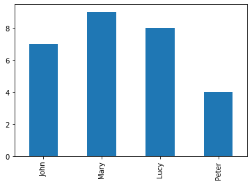
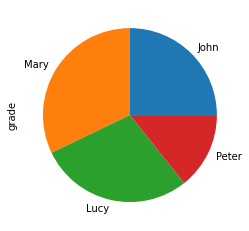
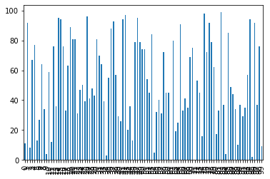

# Gràfiques amb Pandas

A estadística, existeixen 2 tipus:
  - Descriptiva (Gràfiques)
  - Inferencia (Previssions)

Per ajudar-nos en l'estadística que veurem, seria visualitzar i aprendre de la web [khan academy](https://es.khanacademy.org/ "khan academy").

Per realitzar gràfiques, tenim que instal·lar la llibreria **matplotlib**. Llibreria que utilitzara Pandas per sota, nosaltres no la cridarem

Per gràfiques utilitzarem la llibreria Matplotlib(baix nivell) que l'utilitzaran el panda's o seaBorn (alt nivell)

*Comandes d'instal·lació*

```shell
conda install -n py39 -c conda-forge matplotlib
```

A partir d'aqui seguirem el apartat de [plotting](https://pandas.pydata.org/pandas-docs/stable/user_guide/10min.html#plotting "plotting") al tutorial 10 minutes panda 


### Exemple 1. Histograma.

```python
import numpy as np 
import pandas as pd
#np --> numerical panda, es una llibreria per a realitzar càlcul numèric
#les notes de dawbio amb series
student_list=["John","Mary","Lucy","Peter"]
grades_list = [7,9,8,4]
wants_dual_list = [False,True,False,True]
datos: dict[list] = {"grade": grades_list,
                   "dual": wants_dual_list}
students_frame = pd.DataFrame(
    index=student_list,
    data = datos
)
students_frame.loc[:,"grade"].plot(kind="bar")
```


>   <AxesSubplot:>
>





```python
#no aconsellable
students_frame.loc[:,"grade"].plot(kind="pie")
```


>   <AxesSubplot:ylabel='grade'>
>





### Exemple 2. Diagrama barres números aleatoris.

```python
# Continous vars, maje a dataframe with 2 columns
# Each column will have 100 random values (ints).
# Values will range from 0 to 100.


import numpy as np 
import pandas as pd

min_value = 0
max_value = 100

df = pd.DataFrame({ 'edad' : np.random.randint(min_value, max_value ,100),
    'nota' : np.random.randint(min_value, max_value , size=100)})
df.loc[:,"nota"].plot(kind="bar")
```


>    <AxesSubplot:>
>





### Exemple 3. Diagrama circular amb etiquetes (sense Pandas).

[Fitxer font](exemple3-gcircular.py)

```python
# Demo Matplotlib i lectura CSV
import csv
import matplotlib.pyplot as plt

# Read CSV file by file name, with delimiter ';' and utf-8 format.
def read_csv_file(csv_file_path: str) -> list:
    
    with open(csv_file_path, newline='', encoding="utf-8") as csvfile:
        csv_reader=csv.DictReader(csvfile, delimiter=";")
        result = [row_dict for row_dict in csv_reader]
        
    return result


# Obtingudes de: https://www.naciodigital.cat/municipals2019/municipi/08101/hospitalet-llobregat
csv_file_path: str = "vots-lh-mun-2019.csv"
election19Results: dict = read_csv_file(csv_file_path)

print(election19Results[0])

# Obtenim els vots, regidors i el nom dels partits en 3 llistes separades.
votsPartits: int = []
nomPartits: str = []
regidors: int = []

for resultatPartit in election19Results:
    nomPartits.append(resultatPartit['Partit'])
    votsPartits.append(resultatPartit['NumVots'])
    regidors.append(resultatPartit['Regidors'])

print(nomPartits)
print(votsPartits)
print(regidors)


colorsPartits=["Red","Yellow","Orange","Purple","Blue","Pink"]

# Inicialitzem el gràfic de pastís amb les dades i config. adients
# El percentatge el calcula amb el paràmetre autopct="%1.1f%%".
# https://matplotlib.org/3.1.0/api/_as_gen/matplotlib.pyplot.pie.html
plt.pie( votsPartits, labels=nomPartits, autopct="%1.1f%%", colors=colorsPartits, shadow=True)
plt.title("Resultats Eleccions Municipals 2019, vots, L'Hospitalet de Llobregat")
plt.show()

#Esborrem l'últim valor, partits sense regidors.
regidors.pop()
nomPartits2 = nomPartits
nomPartits2.pop()

plt.plot( regidors, labels=nomPartits2, kind="bar", colors=colorsPartits)
plt.title("Resultats Eleccions Municipals 2019, regidors, L'Hospitalet de Llobregat")
plt.show()

```

### Exercici. Fes una o més gràfiques d'un dels fitxers que hem vist a classe amb Pandas.


