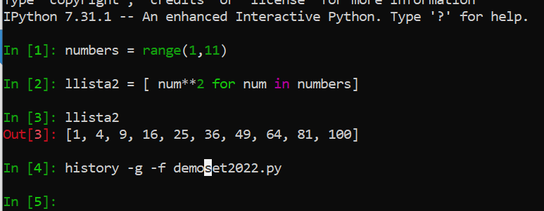
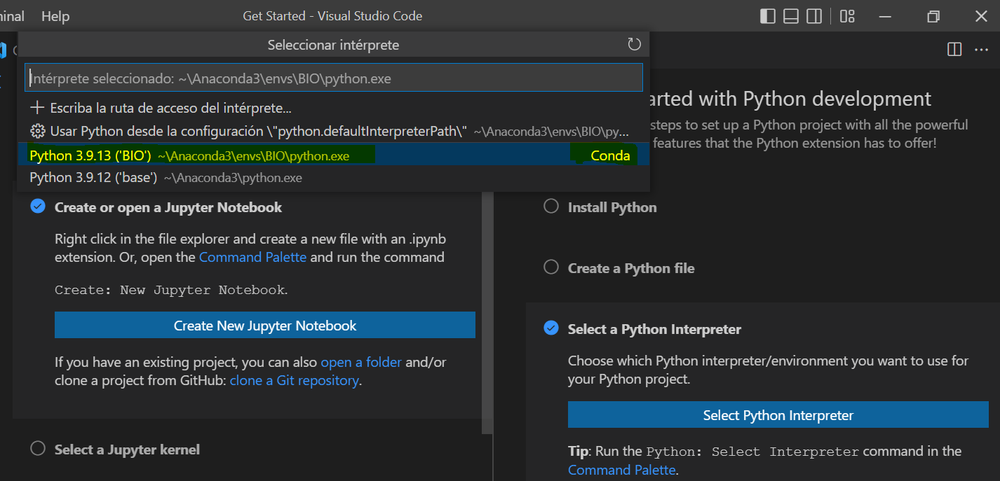

# Instalació disc dur SSD USB bootable amb Linux
## Pablo Garcia, Miquel Angel Bardají, Miquel Amorós.


<a name="toc"></a>

* [Instal.lació PopOs o Ubuntu en un SSD](#installpopos)
* [Instal·lació d´una versió de Python diferent del sistema Linux amb Anaconda](#python)
* [Comandes bàsiques gestor Conda](#conda)
* [Intèrprets de Python](#interprets)
* [Entorn JupyterLab](#jupyterlab)
* [IDE VSCode](#vscode)
* [Desinstal.lació Conda](#uninstallconda)

<a name="installpopos"></a>

### Instal·lar PopOS 22.04 LTS

## <strong style="color:red;"> Abans de tot, cal fer còpies de seguretat de totes les dades!</strong>

**⚠️ Un cop fetes, per experiència us recomanem que torneu a instal.lar des de 0 el sistema a la versió 22.04 LTS si no el teniu Aquesta guia us ajudarà. ⚠️** 

**Si teniu Ubuntu 22 LTS també funcionarà tot OK per aquest curs.**

En canvi, si teniu PopOS 20 LTS o Ubuntu recomanem la instal·lació des de 0 en comptes del **full-upgrade**. Tot i que [la pàgina oficial assegura que amb dues comandes s'actualitza el sistema](https://support.system76.com/articles/upgrade-pop/), la veritat és que en ocasions poden deixar de funcionar programes i perifèrics després de l'actualització. Amb Ubuntu ens ha passat i Popos també hi ha risc que passi. 


<a name="installpopos"></a>

### Hardware necessari
 - USB(3.0) de >= 8 GB Linux
 - ISO amb el PopOS (iso és el fitxer que té l'estructura d´un cd) El ordinador creurà que la ISO és un CD. → Instal·lador y un modo live(de prueba). 
 - Disc dur SSD >= 128 GB → Aconsellats: Crucial, SanDisk, Kingston, PNY. Comprar-los a PC Componentes o comerços online grans.
 - Cable Sata 3.0 → USB 3.0 (el podeu comprar apart o bé us ve inclòs amb el SSD) 

### Programari necessari (2 opcions)

1. **Màquina arranca en mode UEFI**, baixar la ISO de --> [Pop_Os](https://pop.system76.com/)
  
Instalador fàcil, No usa GRUB, sino systemd-boot. 

Alternativa Espanyola del systemd-boot [Slimbook](https://slimbook.es/). 

El SystemBoot de la BIOS ha d'estar desactivat.

2. **Màquina NO arranca en mode UEFI o no es vol PopOS** baixar la ultima [ISO de Ubuntu Desktop LTS](https://ubuntu.com/download/desktop) 

### Passos a seguir per l'USB bootable

 1. Descarregar iso escollida.
 2. Executar el [BalenaEtcher](https://www.balena.io/etcher/), esculleixes la ISO(elegida) i t'assegures de triar l'USB, **⚠️ no el disc dur del PC ⚠️**
 3. Arrancar amb el usb en lloc del disc dur. Amb la tecla que sigui per arrancar la uefi(ESC/F2/F1/F8/F9)

#### Glossari:

> **Firmware**, el software dins del hardware perquè funcioni.

> **Bios** - Basci Input/Output System - Mort al 2013
> - Tabla Particions MBR, màxim 4 particions primàries per disc

> **UEFI** - Universal EFI = EFI 20 Extensible Firmware Interface - Live -
>  Tabla Particiones GPT: GUID Partition table, Màxim 128 particions primàries per disc

> **UUID:** Universal Unique ID

 3. Arrancar en **mode UEFI el usb** → Hi ha l´opció try demo, que és recomanable per provar si funciona el sistema operatiu abans de fer la còpia al ssd,  i les opcions a escollir, preferentment serien: 
    - Software  Angles-Irlanda
    - Elegir keyboard-Español amb especificació català si volem
    - Escollir l´opciò **Clean Storm**, borra tots els fitxers. 
    - Aquí tries el disc dur extern. ⚠️ Aquest moment has de triar el disc dur (SSD) i no equivocar-te. ⚠️
    - No escollir l´opció encriptar el password, perque si hi ha un problema, des de fora es pot ajudar una mica més.

### Utilitats i comandes Ubuntu

- INXI --> és una ordre que trobem en l'última versió d'Ubuntu (i PopOS) i que ens mostra totes les especificacions de l´equip, des del sòcol del processador fins al nucli de sistema operatiu que estem fent servir passant pels processos oberts que està executant el sistema operatiu.

https://ubunlog.com/inxi-cli-informacion-equipo/#Instalar_inxi

```sh
apt install inxi
inxi
```

- System Monitor --> 
Recomanable [crear una drecera per activar el system-monitor per si es realenteix el sistema](https://askubuntu.com/questions/399992/how-to-open-system-monitor-easily). 
És l'equivalent al Adm. Tasques del Windows.

<hr/>
<a name="python"></a>

## Instal·lació d´una versió de Python diferent del sistema Linux.

🚩 És convenient no utilitzar el Python que ve instal·lat per defecte, sinó crear un entorn virtual amb el seu Python, les seves llibreries i aïllat del sistema. Això ho farem amb Conda. També es podria fer amb venv (Virtualenv) i pip.

🚩 També és important no utilitzar la comanda sudo a partir d'ara, treballarem en mode usuari sense privilegis per no alterar el SO. A les companyies on treballarem rarament estarem al grup de sudoers (rarament serem admin). 

🚩 Per tant, prohibit <strike>sudo pip install ... </strike>

Fem unes comprovacions prèvies:

- Per saber la versió que tenim de Python,  escriure a la línia de terminal **python3 --version**
- Per saber on és l'executable del teu python **which -a python3**. 
- Es pot utilitzar **ls -lisah /bin/python3**, i es veu on es localitza l'executable i es veu quin executable realment utilitza, quant a la terminal escrivim python3. Al llistat pot sortir **blau claret**, que vol dir que és executable.
	  
- Per poder instal·lar la nostra versió de python, necessitem saber on es troben els python de sistema, per no fer-los malbé. Posarem la comanda **echo $PATH | sed -E "s/:/\n/g"**.

Ara sí, instal·larem **Conda - Anaconda**, que és un software que ens permet dues coses:
	  
- **Gestor d'entorns virtuals** Un directori amb llibreries i executables, aïllats de la resta. Així evitem problemes de compatibilitat. Anaconda els posa a anaconda3/env
	    
- **Gestor de paquets** Conjunt d´arxius necessaris per a un executable o llibreria (codi que es pot executar des de un executable). Suporta Python i R.
	       
L´instal·larem perque no permet requerir permis d'administrador (ideal per empreses)
	
	1.  Baixarem l'instal·lador de la pagina oficial de [Anaconda](https://www.anaconda.com/products/distribution) - **64-Bit (x86) Installer ** *64-Bit(la quantitat de memoria que podem dirigir) (x86 *(Arquitectura Intel)*) *.  Extensió sh (shell)
	2. Dins l'instal·lador podem mirar dins el fitxer amb **less nom_fitxer**, i veiem quin codi hi ha.
	3. Executem "sh nom_instal·lador.sh"  i hem de fer els passos:
	```sh
		> Do you accept the license terms? [yes|no]
		>[no] >>> yes
		>Anaconda3 will now be installed into this location:
		>/home/alumne/anaconda3
		>
		>  - Press ENTER to confirm the location
		>  - Press CTRL-C to abort the installation
		>  - Or specify a different location below
		> ...
		>Preparing transaction: done
		>Executing transaction: done
		>installation finished.
		>Do you wish the installer to initialize Anaconda3
		>by running conda init? [yes|no]
		>[no] >>> **yes**
	```
		
	Un cop instal·lat i perquè s'adoni del canvi, **tanquem la terminal i la tornem a obrir**. Sinò et surt pots seguir aquest [tutorial](https://www.solvetic.com/tutoriales/article/8876-instalar-anaconda-en-ubuntu-20-04/)
		>Ajuda --> Ctrl-C (tancar proces amb linux)
		 
	 Si sense voler no ens ha parat a la pregunta conda init (hem apretat el enter mentre s´estaven descomprimint arxius) --> Llavors fiquem ./ conda_init (executable al directori actual, ens hem de ficar a "~/anaconda3/bin")

[Índex de continguts](#toc)

<hr/>
<a name="conda"></a>

## Comandes bàsiques pel gestor Conda.

· [CheatSheet Conda](https://docs.conda.io/projects/conda/en/latest/user-guide/cheatsheet.html) 

### Comandes comprovacions previes a la instal·lació de python3
A l'arrancar el terminal et sortirà la paraula (base), és el intèrpret de Conda, i l'entorn base que crea sempre per defecte. Per poder sortir de l'intèrpret, NO ES *CTRL-C*, sinò es *Ctrl-D* (fi d'ordres de teclat), però això tanca el terminal, en tornar a obrir sortirà.

**Comprovacions**

- Per saber que tenim python d´anaconda, podem ficar la instrucció **which -a python3**, i veiem el nou python.
- Per saber on es conda, executem **which -a conda**.
- Per veure el propietari **ls -lisah /home/alumne/anaconda3/bin/conda**
- Comanda friki **ls -lisah $(which conda)**, la sortida de la comanda interior, es la entrada de la comanda més exterior.

### Comandes instal·lació de Python amb Anaconda.

Executem aquesta comanda per actualitzar Conda a la última versió. 
Si ja tenim una versió recent no cal.

```sh 
conda update -n base -c defaults conda
```

### Crear el teu propi entorn. 

Creem un nou entorn Conda (així no trepitgem l'entorn base)

[tutorial](https://www.devacademy.es/entornos-virtuales-en-python-anaconda).

**Recomanació: Un nom amb minúscules i curt. Per exemple: bio.**

#### Pas 1.

```sh
conda create -n nomenv
```

#### Pas 2.

Instal.lem una llibreria, la del Jupyter Labs

<em>Acrònim de: Ju -> Julia, Py -> Python, R -> R.</em>

```sh
conda install -n nomenv -c conda-forge jupyterlab
```

#### Pas 3.
Per activar-lo, un cop ja es troba creat fem:

```sh
conda activate nomenv
```
#### Pas 4.
Per desactivar l'entorn (i usar-ne un altre), trobant-nos al entorn s'utilitza 

```sh
conda deactivate
```
També podem veure la llista d'entorns:

```sh
conda env list
```

Per esborrar un entorn:
```sh
conda env remove -n nomenv
```

### Instal·lació python --> 

Un cop instal·lat un entorn de Conda, Python queda instal·lat a la última versió (la 3.10 l'any 2022).

Ho podem verificar mitjançant la comanda:
```sh
python --version
```

<hr/>
<a name="interprets"></a>

## Intèrprets, amb els que podem treballar amb python:

- **python3**
Molt bàsic.
- **ipython** (depen del python3), versió amb format enriquit i amb colors. Versió no oficial de python. Ens permet guardar l'historial, ideal per fer proves ràpides.
- 


- **jupiterlab** (va al navegador i treballar amb ipython),[cheatsheet JupiterLab](https://blog.ja-ke.tech/assets/jupyterlab-shortcuts/Shortcuts.png "cheatsheet JupiterLab"), ficarem per executarlo a la consola 

```bash
jupyter lab
```

[Índex de continguts](#toc)


<a name="jupyterlab"></a>

### Entorn JupyterLab

JupyterLab és una interfície d'usuari basada en web per a Júpiter del projecte i està estretament integrat a Adobe Experience Platform i Google Colab.

Proporciona un entorn de desenvolupament interactiu perquè els científics de dades treballin amb Jupyter Notebooks, codi i dades.

#### Instal·lació [Jupyter Lab](https://jupyter.org/). 

Comanda (directori no oficial): 

```bash
conda install -n nomenv -c conda-forge jupyterlab
```

<a name="vscode"></a>

### Integració IDE VSCode.

Va molt bé integrar el nostre entorn operatiu (Conda, Python, Jupyter, llibreries com Pandas... ) a Visual Studio Code.

#### Important! Instal.leu la versió deb, no la flatpak.

La podeu instal.lar o bé pel PopOS! Shop

O bé pel terminal

```bash
apt-get install vscode
```

VSCode ens pregunta si volem instal.lar eines per a Pyhton, li diem que sí. 
També podem instal.lar-ne per a Markdown. 

A la part inferior per defecte ens sortirà el Python que tenim a la màquina. 
Si la instal.lació de Conda ha funcionat podem seleccionar el Python de l'entorn de Conda que hem instal.lat prèviament.



Podem provar els 2 tipus de fitxers.
1. Un de Pyhton (*.py)
2. Un de Jupyter Notebook (*.ipynb)


**Area de treball** 

  Extensió dels projectes: **.ipynb**  

  2 modes de treball:
  
  --> 1 Edició
  
  --> 2 Comandes
				   
  2 tipus de cel·la: 
  
  --> Python (tecla ESC i despres'y'), serveix per codificar
  
  --> Markdown (tecla ESC i despres 'm'), serveix per documentar la codificació
		   	   
**Abreviaturas**

	Shift+Intro --> Executar una cel·la i anar a la següent
	Ctrl + Intro --> Executar una cel·la i es queda a la mateixa.

[Índex de continguts](#toc)

<hr/>

<a name="uninstallconda"></a>

### Desinstal.lació Conda

Si mai fa falta, podeu desinstal.lar Conda així:

1. Esborrrar el directori 
```<dir_home>/anaconda3```

2. Editar l'arxiu ```.bashrc```, que conté la ruta dels executables de Conda, entre d'altres.

Esborrem el bloc de codi que comença i acaba per conda initialize.

```sh
# >>> conda initialize >>>
# !! Contents within this block are managed by 'conda init' !!
__conda_setup="$('/home/alumne/anaconda3/bin/conda' 'shell.bash' 'hook' 2> /dev/null)"
....
fi
unset __conda_setup
# <<< conda initialize <<<
```
3. Esborrar altres directoris de backups que conda hagi pogut crear.

Per exemple: .conda

[Índex de continguts](#toc)
