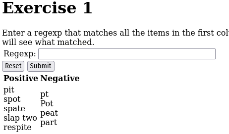
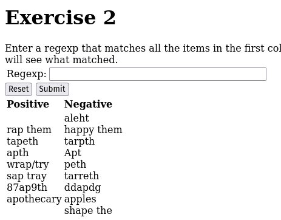
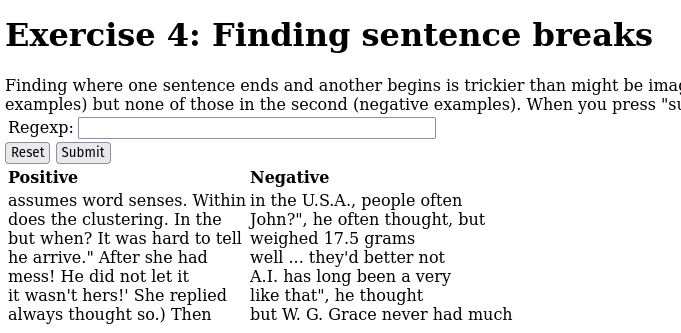

## Exercicis pràctica expressions regulars

Els exercicis els farem a partir [regex.eu](http://regex.sketchengine.eu "regex.eu")

Podem seguir el manual fet a classe en sessions anteriors, sinò podem ajudar-nos del [tutorial regex](https://www.sketchengine.eu/guide/regular-expressions/ "tutorial regex")

Practicarem les 4 estràtegies
 1. Positiva
 2. Negativa
 3. Múltiples Regex
 4. Fer grups

------------
### Exercici 1

a) Ho fem inicialment ficant totes les parts positives i veiem els patrons.

 > pi, po, pat, p(espai)

b) Treure el patró d'aquestes parts úniques

 > p[aio ]t

 i d'aqui podem treure la solució

 > p.t

------------
### Exercici 2

a) Ho fem inicialment ficant totes les parts positives i veiem els patrons.

 > (ap.|ape|apt|ap\/|ap9|apo)[thr]

b) Treure el patró d'aquestes parts úniques

El patró positiu podria ser aquest

> ap.[th]

Si utilitzessim el patró amb negatiu.

> ap.[^pd][^ ]

------------
### Exercici 3

Solucions 

> [^.]fg[.fkh]  
> [arb].fg..
> af..[fak.]

------------
### Exercici 4

Una primera aproximació, mirant de concatenar grups per agafar-ho tot, seria aquesta regla 

> [^A-Z][.!)?"'].[A-Z]

d'aqui podem treure la nova versió, treien que no hi hagi cap lletra "normal" i també ens serviria

> [^A-Z][^\w].[A-Z]